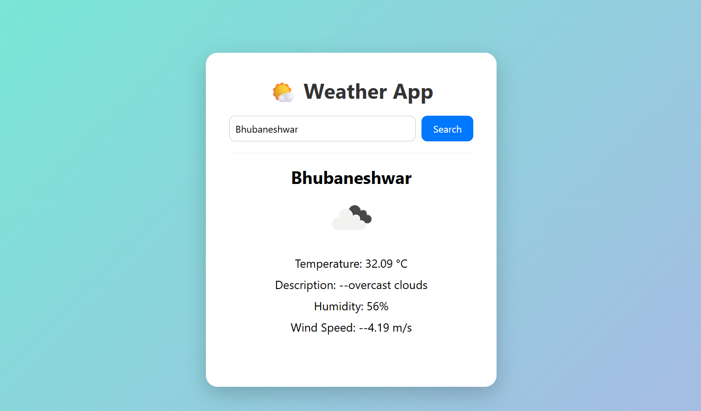

# 🌤️ Weather App

A modern, responsive weather application that provides real-time weather information for any city worldwide. Built with vanilla HTML, CSS, and JavaScript, featuring a clean user interface and seamless API integration.

## ✨ Features

- **Real-time Weather Data**: Get current weather conditions for any city
- **Beautiful UI**: Modern, responsive design with gradient backgrounds
- **Weather Icons**: Visual weather representation with OpenWeatherMap icons
- **Comprehensive Info**: Temperature, description, humidity, and wind speed
- **Error Handling**: Graceful error management for invalid inputs
- **Mobile Responsive**: Optimized for all device sizes
- **Fast Loading**: Lightweight vanilla JavaScript implementation

## 🚀 Live Demo

**[View Live Demo](https://weather-app-beryl-gamma-54.vercel.app/)**

*Replace the above link with your actual GitHub Pages or hosting URL*

## 📸 Screenshots

### Desktop View


### Mobile View


*Add actual screenshots to a `screenshots/` folder in your repository*

## 🛠️ Technologies Used

- **HTML5** - Structure and semantics
- **CSS3** - Styling and responsive design
- **JavaScript (ES6+)** - Dynamic functionality and API integration
- **OpenWeatherMap API** - Weather data source
- **Fetch API** - HTTP requests

## 📋 Prerequisites

Before running this project, you need:

- A modern web browser (Chrome, Firefox, Safari, Edge)
- Internet connection for API calls
- OpenWeatherMap API key (free registration required)

## ⚙️ Installation & Setup

1. **Clone the repository**
   ```bash
   git clone https://github.com/your-username/weather-app.git
   cd weather-app
   ```

2. **Get your API key**
   - Visit [OpenWeatherMap](https://openweathermap.org/api)
   - Sign up for a free account
   - Generate your API key

3. **Configure API key**
   - Open `script.js`
   - Replace the existing API key with your own:
   ```javascript
   const API_KEY = 'your-api-key-here';
   ```

4. **Launch the application**
   - Open `index.html` in your web browser
   - Or use a local server:
   ```bash
   # Using Python
   python -m http.server 8000
   
   # Using Node.js
   npx serve .
   ```

## 🎯 Usage

1. **Search for Weather**
   - Enter any city name in the search box
   - Click the "Search" button or press Enter
   - View the weather information displayed

2. **Weather Information Includes**
   - Current temperature in Celsius
   - Weather description
   - Humidity percentage
   - Wind speed in m/s
   - Weather icon representation

## 📁 Project Structure

```
weather-app/
│
├── index.html          # Main HTML structure
├── style.css           # Styling and responsive design
├── script.js           # JavaScript functionality
├── screenshots/        # Application screenshots
│   ├── desktop-view.png
│   └── mobile-view.png
└── README.md          # Project documentation
```

## 🔧 Configuration

### API Configuration
The app uses OpenWeatherMap API. Configure in `script.js`:

```javascript
const API_URL = 'https://api.openweathermap.org/data/2.5/weather';
const API_KEY = 'your-api-key-here';
const UNITS = 'metric'; // metric, imperial, or kelvin
```

### Customization Options
- **Units**: Change temperature units (metric/imperial/kelvin)
- **Styling**: Modify CSS variables for colors and themes
- **Language**: Add language parameter to API calls

## 🌐 API Reference

This project uses the [OpenWeatherMap Current Weather API](https://openweathermap.org/current).

**Endpoint**: `GET https://api.openweathermap.org/data/2.5/weather`

**Parameters**:
- `q`: City name
- `appid`: Your API key
- `units`: Temperature units (metric/imperial/kelvin)

## 🔒 Security Notes

- **API Key**: Never commit your actual API key to version control
- **Environment Variables**: Use environment variables for production
- **Rate Limiting**: Be aware of API call limits (1000 calls/day for free tier)

## 🎨 Customization

### Changing Colors
Modify the CSS gradient in `style.css`:
```css
body {
  background: linear-gradient(135deg, #your-color1, #your-color2);
}
```

### Adding Features
- Temperature unit conversion
- 5-day forecast
- Geolocation support
- Weather alerts
- Multiple city comparison

## 🐛 Troubleshooting

### Common Issues

1. **API Key Error**
   - Ensure your API key is valid and active
   - Check if you've exceeded the rate limit

2. **City Not Found**
   - Verify correct city name spelling
   - Try using city name with country code (e.g., "London,UK")

3. **Network Issues**
   - Check internet connection
   - Verify API endpoint accessibility

## 🤝 Contributing

Contributions are welcome! Please follow these steps:

1. Fork the repository
2. Create a feature branch (`git checkout -b feature/AmazingFeature`)
3. Commit your changes (`git commit -m 'Add some AmazingFeature'`)
4. Push to the branch (`git push origin feature/AmazingFeature`)
5. Open a Pull Request

### Development Guidelines
- Follow consistent code formatting
- Add comments for complex functionality
- Test on multiple browsers
- Update documentation for new features

## 📄 License

This project is licensed under the MIT License - see the [LICENSE](LICENSE) file for details.

## 👤 Author

**Your Name**
- GitHub: [@your-username](https://github.com/AlgoAce-Shrao)
- LinkedIn: [Your LinkedIn](https://www.linkedin.com/in/shraojit-das-636661336?lipi=urn%3Ali%3Apage%3Ad_flagship3_profile_view_base_contact_details%3Bl13ec2CORVitWD7XJI5QcQ%3D%3D)
- Email: shraojitdas@gmail.com

## 🙏 Acknowledgments

- [OpenWeatherMap](https://openweathermap.org/) for providing the weather API
- Community contributors and testers

## 📊 Performance

- **Lighthouse Score**: 95+ (Performance, Accessibility, Best Practices, SEO)
- **Load Time**: < 2 seconds on average connection
- **Bundle Size**: < 50KB total

## 🔮 Roadmap

- [ ] Add 5-day weather forecast
- [ ] Implement geolocation detection
- [ ] Add weather maps integration
- [ ] Create mobile app version
- [ ] Add offline functionality
- [ ] Implement user preferences storage
- [ ] Add weather notifications

---

⭐ **If you found this project helpful, please give it a star!** ⭐
